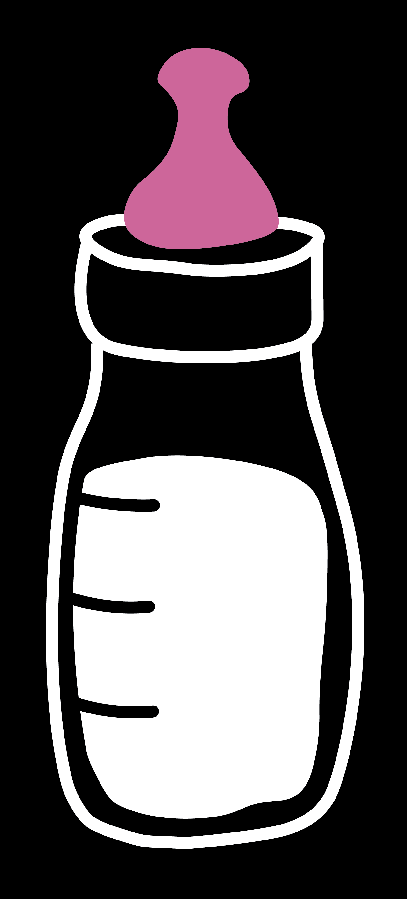
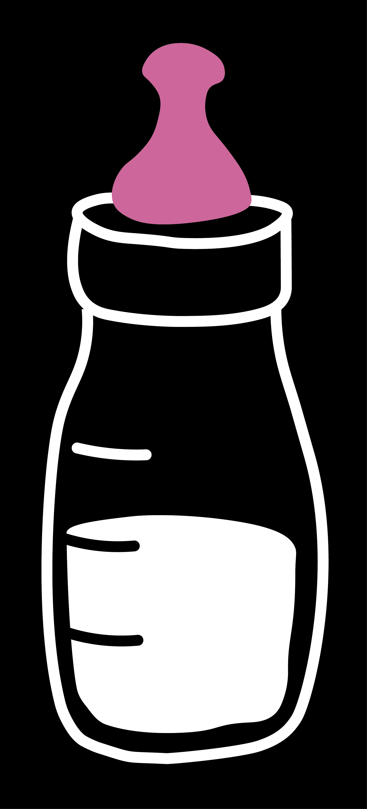
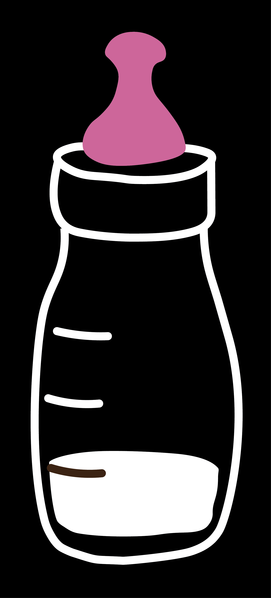
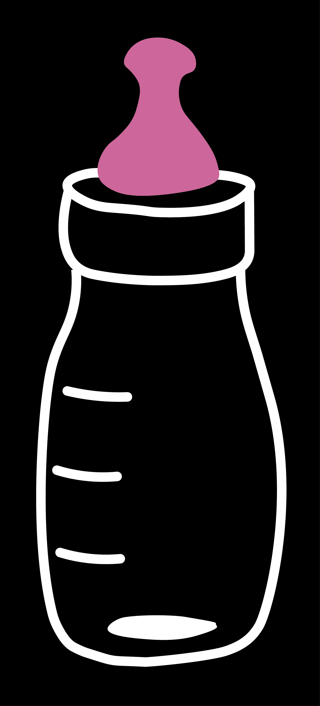
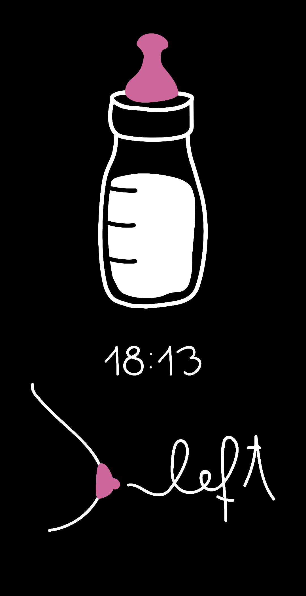

# milk timer

Timer app for beginner mothers. 

The nursery bottle represents the stomach of the baby. 
After feeding the mother can fill the bottle and set the feeding time and the main side.
The nursery bottle has four different states. It changes in every hour, as the baby becomes hungrier, the amount of the milk decreases.

The states:

| Full          | Almost full (After 1 hour) | Almost empty (After 2 hours) | Empty (After 3 hours) |
| :-----------: | :-----------: | :-----------: | :-----------: |
|   |   |   |   |

Sample screenshot:

